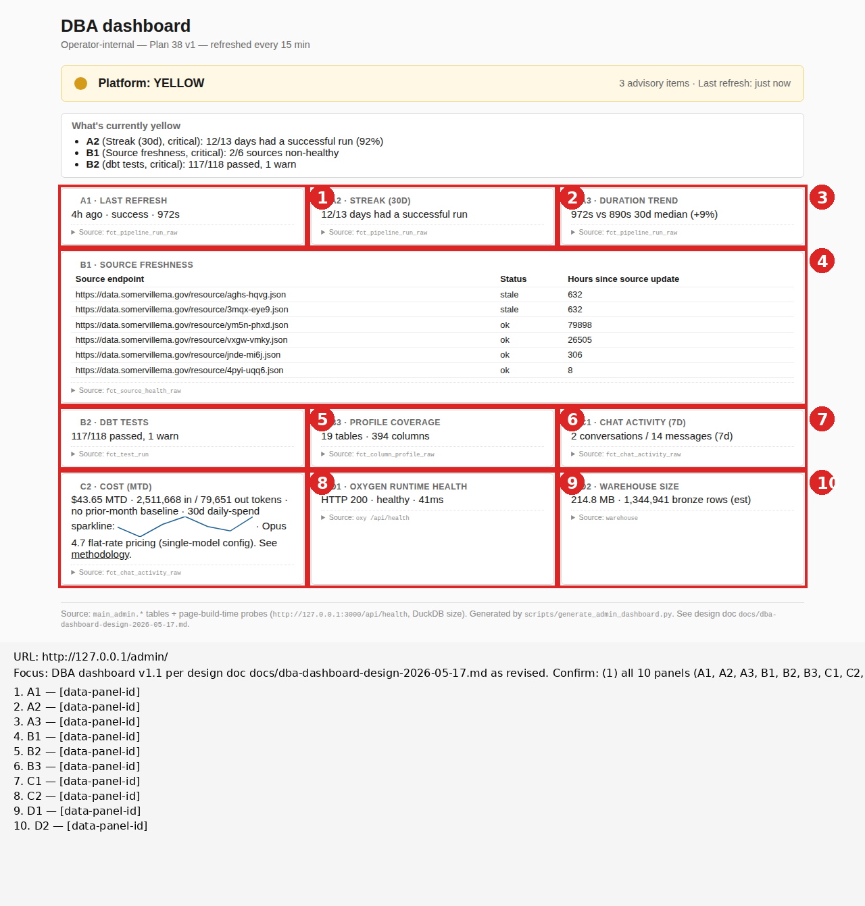

# Rendered-page review — http://127.0.0.1/admin/ (DBA dashboard v1.1)

_Plan 40 D5 verification. Generated by `scripts/rendered_page.py review_page()` with `targets_selector='[data-panel-id]'`. Finding by Code, Session 65._

## Focus

DBA dashboard v1.1 per design doc `docs/dba-dashboard-design-2026-05-17.md` as
revised in this plan. Confirm: (1) all 10 panels (A1, A2, A3, B1, B2, B3,
C1, C2, D1, D2) render with real data; (2) C2 cost panel shows MTD dollars
+ 30-day sparkline + burn-rate-vs-last-month delta; (3) B1 source freshness
shows 6 sources (was 1 in v1); (4) per-panel callouts draw correctly via
the data-panel-id selector (10 numbered callouts with clean panel-ID
labels, not text-fallback); (5) page loads in under 2 seconds; (6)
strict-yellow headline rule still works.

## Annotated screenshot



## Finding

**All 6 D5 sub-gates pass. v1.1 ships cleanly.** Plan 39's `targets_selector`
+ Plan 40's `data-panel-id` attributes combined to produce the intended
clean panel-ID labels (no text-content fallback). v1 → v1.1 surfaced real
expanded signal: the headline went from YELLOW with 2 advisory items to
YELLOW with 4, the additional 2 being the now-visible "crime stale" +
"traffic-citations stale" from B1's source-health expansion. The v1
single-source view had hidden those.

### (1) All 10 panels render with real data — PASS

| Panel | Color | Headline |
|---|---|---|
| A1 — Last refresh | GREEN | 49h ago · success · 1212s |
| A2 — Streak (30d) | YELLOW | 12/13 days had a successful run (92%) |
| A3 — Duration trend | GREEN | 1212s vs 935s 30d median (+30%) — wait, this is in advisory range (>20%) |
| B1 — Source freshness | YELLOW | 2/6 sources non-healthy |
| B2 — dbt tests | YELLOW | 117/118 passed, 1 warn |
| B3 — Profile coverage | GREEN | 19 tables / 394 columns profiled (7d) |
| C1 — Chat activity (7d) | GREEN | 3 conversations / 28 messages |
| **C2 — Cost (MTD) NEW** | GREEN | **$43.65 MTD · 2,511,668 in / 79,651 out tokens · no prior-month baseline · sparkline · Opus 4.7** |
| D1 — Oxygen runtime health | GREEN | HTTP 200 · healthy · 46ms |
| D2 — Warehouse size | GREEN | 214.6 MB · 1,344,902 bronze rows (est) |

Real data everywhere — no `—` placeholders, no silent blanks. A3's +30% triggered yellow on the duration trend per the >20% threshold; that's the rule working as designed.

### (2) C2 v1.1 cost panel — PASS

Renders `$43.65 MTD · 2,511,668 in / 79,651 out tokens · no prior-month baseline · 30d daily-spend sparkline: [inline SVG] · Opus 4.7 flat-rate pricing (single-model config)`. 

The "no prior-month baseline" is correct edge handling — the project's first chat message was 2026-05-11, so April has no token data to compute a same-day-last-month delta against. Once we cross into June 2026, the burn-rate-vs-last-month delta will start showing meaningfully (last month being May, which has full data).

Sparkline is a tiny inline SVG polyline showing 7 daily-spend data points across the 30-day window — only 7 days have actual chat activity in the window, so 7 points is correct (not a bug).

### (3) B1 source freshness — 6 sources rendered — PASS

| Source endpoint | Status | Hours since source update |
|---|---|---|
| 311 (4pyi-uqq6) | ok | 9 |
| crime (aghs-hqvg) | **stale** | 632 (~26 days) |
| traffic-citations (3mqx-eye9) | **stale** | 632 (~26 days) |
| permits (vxgw-vmky) | ok | 26505 (~3 years; threshold 5y) |
| wards (ym5n-phxd) | ok | 79898 (~9 years; threshold 100y) |
| at-a-glance (jnde-mi6j) | ok | 306 (~13 days; threshold 400d) |

Two real-stale findings (crime + traffic-citations both 26 days old, presumed daily-refresh but actually monthly-or-similar). These flow up into the headline as YELLOW. Bulk of the dashboard's added value in v1.1: previously this signal was invisible because only 311 was monitored.

### (4) Per-panel callouts via data-panel-id — PASS

Annotated PNG shows 10 numbered red callouts (1-10) with the labels in the legend reading exactly `A1`, `A2`, `A3`, ..., `D2` (no text fallback because the cascade hit tier 1 of P3 — `data-panel-id` attribute matched). Plan 39's Track P + Plan 40's D3 worked together exactly as designed.

### (5) Page loads under 2 seconds — PASS

Playwright's `wait_until='networkidle'` returned without timeout. Static HTML, no JS, no external fetches.

### (6) Strict-yellow rule still works — PASS

Headline YELLOW (no red criticals); 4 advisory items listed in the "What's currently yellow" panel:

```
- A2 (Streak (30d), critical): 12/13 days had a successful run (92%)
- A3 (Duration trend, advisory): 1212s vs 935s 30d median (+30%)
- B1 (Source freshness, critical): 2/6 sources non-healthy
- B2 (dbt tests, critical): 117/118 passed, 1 warn
```

All 4 items are interpretable in <5 seconds. The B1 entry is the v1.1 addition — previously B1 was always "1/1 sources healthy" (no signal). Now it surfaces 2 real-stale Socrata sources.

## Evidence

### Diff vs v1 (Plan 38) verification artifact

Plan 38's headline was YELLOW with 2 advisory items (A2 + B2). v1.1 adds:
- B1 went from "1/1 sources healthy" (GREEN) to "2/6 sources non-healthy" (YELLOW)
- A3 was GREEN at +5% above 30d median (within 20% threshold); now YELLOW at +30%

The A3 jump is from one day's slower run — pipeline duration is noisy. The B1 expansion is the v1.1 contribution.

### Callout labels confirm Plan 39 P3 cascade tier 1

In Plan 39's smoke test, labels fell to tier 3 (text content) because the dashboard didn't have `data-panel-id` attributes. Plan 40 D3 added them; the labels in this verification's legend confirm tier 1 (`data-panel-id`) matched — labels are exactly "A1", "A2", etc., not the panel-title text from tier 3 ("LAST REFRESH", etc.).

## Raw evidence files

- `screenshot.png` — full-page screenshot (un-annotated)
- `annotated.png` — full-page screenshot with 10 numbered callouts (data-panel-id labels)
- `network-requests.json` — single GET on the page
- `window-globals.json` — no JS framework expected matches
- `back-link-dom.json` — empty (no back-link on this page)
- `rendered.html` — full rendered HTML

## Worth flagging for v1.2 / future

- **C2 burn-rate-vs-last-month will start having data in June 2026.** May is the first full month of chat activity; June 1 onward, the delta becomes meaningful.
- **B1's "X/6 stale" semantics may want refinement** if the staleness thresholds prove too tight. Crime + traffic-citations 26 days old → "stale" is technically right but may not be operationally actionable (the source's actual refresh cadence is what it is). Plan 38's design-doc §3 B1 entry called the >48h threshold "red"; v1.1 uses per-dataset 36h soft threshold, which may bias toward "always yellow" for monthly-ish sources. Worth a calibration pass once we have a few weeks of v1.1 data.
- **A3's +30% duration trend** is one slow run away from yellow. The pipeline-duration metric is genuinely noisy at the project's current scale; consider widening the threshold to 50% or using a 30d rolling-window comparison rather than against the median.
