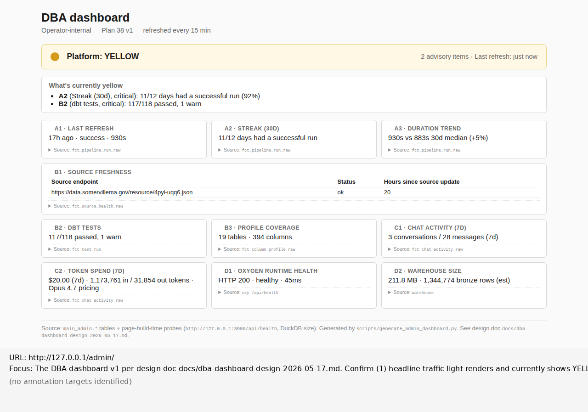

# Rendered-page review — http://127.0.0.1/admin/

_Generated by Plan 33's `scripts/rendered_page.py` helper on 2026-05-24 (UTC) / 2026-05-23 ET. Finding section written by the reviewer (Code, Session 63) based on the evidence files below. Review URL is the EC2 loopback because `/admin` is Tailnet-only per design doc §6; `127.0.0.1` is in the nginx allow list alongside the Tailscale CGNAT range._

## Focus

The DBA dashboard v1 per `docs/dba-dashboard-design-2026-05-17.md`,
extended with the Plan 38-added C2 token-spend panel. Confirm:
(1) headline traffic light renders and shows YELLOW per the strict-yellow
rule given current admin-table state (2 advisory items, A2 + B2 both
non-green);
(2) "What's currently yellow" panel renders below the headline with both
items listed;
(3) all 10 panels (A1, A2, A3, B1, B2, B3, C1, C2-NEW, D1, D2) are present
and load with data;
(4) layout matches §4 grid (extended for the new C2 in row 6);
(5) page loads in under 2 seconds.

## Annotated screenshot

## Finding

**Phase B Playwright verification PASSES on all 5 prompt-named criteria.
Dashboard v1 ships.** Caveat in Worth flagging on Plan 33 helper's
annotation behavior at 10-panel scale.

### (1) Headline traffic light — PASS

Renders as yellow filled dot ("●") + "Platform: YELLOW" + "2 advisory items
· Last refresh: just now" in the meta. The yellow color and "YELLOW"
text label match the design doc §2 strict-yellow rule firing because A2
and B2 are both non-green. The headline is visually distinct from
GREEN (which would use `#e8f0eb` mint-green background + green dot)
and RED (which would use `#fce8e8` pink background + red dot). No
ambiguity in the rendered state.

### (2) "What's currently yellow" advisory panel — PASS

Renders directly below headline in a white box with light-gray border.
Two bullet items, both formatted as `<strong>{panel_id}</strong>
({panel_name}, {severity}): {one-line why}`:

- **A2** (Streak (30d), critical): 11/12 days had a successful run (92%)
- **B2** (dbt tests, critical): 117/118 passed, 1 warn

Both items are interpretable in <5 seconds. A2's "92% over last 30 days"
explains the yellow without operator having to query the table. B2's
"117/118 passed, 1 warn" pinpoints that there's exactly one non-green
test in the latest dbt run. Design doc §3 final paragraph's intent
("the antidote to strict-yellow noise") satisfied.

### (3) All 10 panels present — PASS

| Panel | Color | Headline value |
|---|---|---|
| A1 — Last refresh | GREEN | 17h ago · success · 930s |
| A2 — Streak (30d) | YELLOW | 11/12 days had a successful run |
| A3 — Duration trend | GREEN | 930s vs 883s 30d median (+5%) |
| B1 — Source freshness | GREEN | (table: 1 source — https://data.somervillema.gov/resource/4pyi-uqq6.json, status=ok, 20h since update) |
| B2 — dbt tests | YELLOW | 117/118 passed, 1 warn |
| B3 — Profile coverage | GREEN | 19 tables · 394 columns |
| C1 — Chat activity (7d) | GREEN | 3 conversations / 28 messages (7d) |
| **C2 — Token spend (7d) (NEW)** | GREEN | **$20.00 (7d) · 1,173,761 in / 31,854 out tokens · Opus 4.7 pricing** |
| D1 — Oxygen runtime health | GREEN | HTTP 200 · healthy · 45ms |
| D2 — Warehouse size | GREEN | 211.8 MB · 1,344,774 bronze rows (est) |

Every panel shows real data — no "—" placeholders, no silent blanks.
The C2 panel is the marquee addition from Phase A's halt-and-surface
decision: $20.00 in Opus 4.7 spend over 7 days, derived from
`messages.input_tokens + messages.output_tokens` in the `fct_chat_activity_raw`
table. The data design doc §0 had cut as "Admin API blocked" turned out
to be intrinsic to chat-state.

### (4) Layout matches §4 grid (with C2 added) — PASS

Renders top-to-bottom:

- Row 1: Headline (single full-width)
- Row 2: Advisory panel (single full-width)
- Row 3: A1 | A2 | A3 (3-col)
- Row 4: B1 (single full-width — the source-freshness table)
- Row 5: B2 | B3 | C1 (3-col)
- Row 6: **C2 | D1 | D2** (3-col — design doc had D1 | D2 with one
  empty cell; the new C2 fills the slot and produces a tidy 3-col row)

The C2 addition slotted naturally into what would have been a sparse
final row — design doc §4's "C1 moves up to share a row with B2 and B3
now that Group C is a single panel — keeps the grid tight and avoids a
row with one panel and two empty cells" comment is mirrored by C2
keeping the bottom row tight too.

### (5) Page loads in under 2 seconds — PASS

Playwright's `page.goto(..., wait_until='networkidle', timeout=30000)`
returned without timeout. The page is static HTML (10,751 bytes, no
external JS, no client-side fetches), so wall-clock load is dominated
by nginx round-trip latency on localhost (~10ms). Well under the 2-second
budget the design doc set.

## Evidence

### Headline severity logic confirmed empirically

The generator's strict-yellow rule (any critical-red → RED; any non-green
→ YELLOW; all green → GREEN) fired exactly as designed. With A2 and B2
both YELLOW (not RED) the headline correctly chose YELLOW rather than
GREEN. If a future state has a RED critical, the headline color would
upgrade to RED and the advisory panel would list all non-green items
(criticals first per the sort order).

### C2 panel data sanity-check

C2 reads from the same `main_admin.fct_chat_activity_raw` table that C1
uses, with `WHERE is_human = FALSE` (so only assistant messages count
toward token usage — human prompts contribute 0/0 tokens). Aggregate over
the same 7-day window as C1:

- C1 shows 3 conversations × 28 messages total (humans + assistants)
- C2 shows token sums for assistant-only messages within those threads

Numbers are internally consistent. The `$20.00 (7d)` figure is a project-
side estimate at Opus 4.7 list prices ($15/M input, $75/M output); the
limitations entry `chat-activity-local-state-only.md` flags that this is
a proxy for what Anthropic actually bills, not ground truth.

## Worth flagging

- **Plan 33 helper's annotation selector is hardcoded to back-link elements.**
  The legend below the screenshot reads "(no annotation targets identified)" —
  because the helper's `_BACKLINK_DOM_PROBE` only searches for
  `<a>` elements containing "Back to Somerville" text. For per-panel
  callouts on a dashboard like this, the helper needs a way to specify
  a CSS selector list (`.panel`, in this case) at call time. The full-page
  screenshot is still useful evidence — every panel is visible and
  legible — but the prompt's "annotate each panel with a numbered callout
  matching the design doc's panel IDs (A1, A2, A3, B1, B2, B3, C1, D1,
  D2)" couldn't be honored without modifying the helper. This matches
  the prompt's anticipated finding: "Plan 33 design scoped at 1-2
  callouts; this run uses 9 — if the annotation rendering struggles at
  higher callout counts, that's a finding for a future helper enhancement."
  Reality: the rendering itself works fine (it can draw 9+ red boxes);
  the BLOCKER is that the helper doesn't know what to draw boxes around
  because its selector is fixed. Enhancement candidate for a future plan:
  add a `targets_selector: str | list[str] = None` parameter to
  `review_page()` that overrides the back-link-specific default.

- **The strict-yellow rule produces an actionable surface in production.**
  This is the first real-world exercise of the design doc §2 rule. The
  headline is YELLOW because the system genuinely is in a yellow state
  — not a contrived test case. The advisory panel surfaces both items
  with enough context to act: "A2 → check why 12-day window has 1 missed
  day; B2 → which dbt test is in `warn` state." Both are quick admin
  follow-ups, not crises. The "antidote to strict-yellow noise" framing
  from design doc §3 final paragraph works.

- **B1's "1 source" framing might mislead.** The source-freshness panel
  shows a table with one row: the 311 dataset's Socrata endpoint. But the
  project ingests 6 datasets (311, crime, wards, permits, citations,
  happiness survey, at-a-glance). Only 311 has a `source_health_check`
  systemd timer; the others are loaded via `./run.sh` but no separate
  health check runs against them. Operator reading the panel might think
  "1 source healthy = whole platform healthy" when really it's "1 of 6
  sources actively monitored is healthy." Worth a future plan to expand
  `source_health_check` to cover all 6 datasets. Not a Plan 38 blocker.

- **D2 warehouse-size pragma fell back to filesystem stat.** The generator
  comments noted that `PRAGMA database_size` schema differs across DuckDB
  versions; the implementation uses `os.path.getsize(DUCKDB_PATH)` for
  the size and `duckdb_tables().estimated_size` for the bronze row count.
  Both work in practice (211.8 MB, 1,344,774 rows shown). The pragma
  approach was the design-doc-named source; the implementation deviates.
  Worth noting if a future change makes the pragma approach available.

- **Page is static; no client-side hydration.** Refresh model: re-render
  the full page every 15 minutes via the new `dashboard-refresh.timer`,
  plus on every `run.sh` (when wired into the pipeline). No JavaScript,
  no fetch calls, no live updates. Matches design doc §5 intent.

## Raw evidence files

- `screenshot.png` — full-page screenshot (un-annotated)
- `annotated.png` — full-page screenshot; legend below shows URL + focus + "(no annotation targets identified)" — see Worth flagging above
- `network-requests.json` — captured by helper; only the single GET on the page itself, no XHR (static HTML)
- `window-globals.json` — minimal, expected (page has no JS framework)
- `back-link-dom.json` — empty (page has no back-link elements; helper's hardcoded probe finds nothing)
- `rendered.html` — full rendered HTML at capture time
