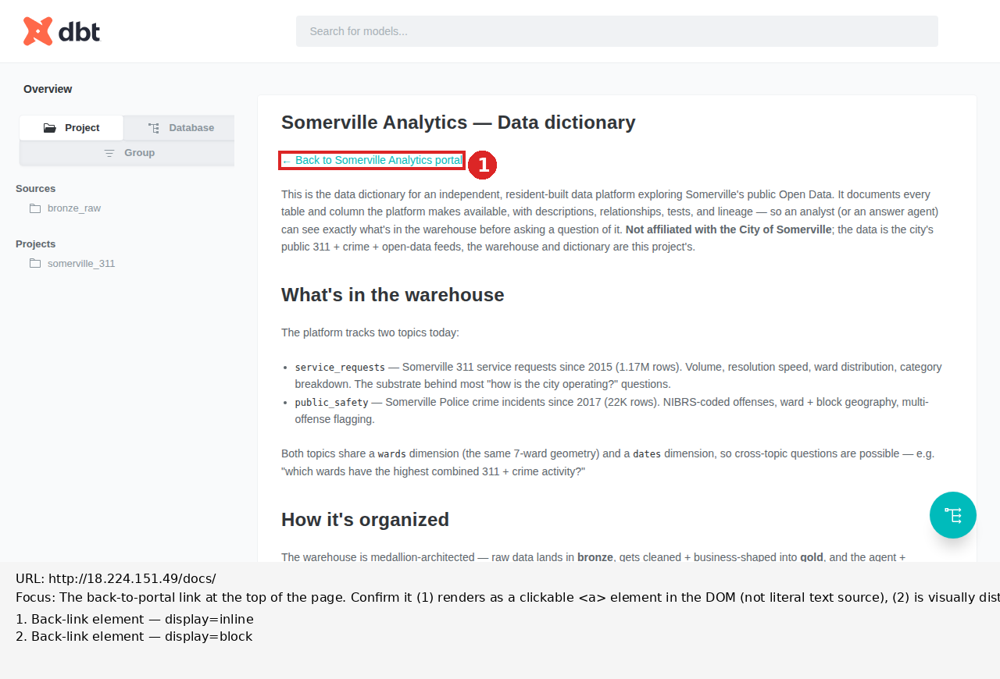

# Rendered-page review — http://18.224.151.49/docs/

_Generated by Plan 33's `scripts/rendered_page.py` helper on 2026-05-23. Finding section written by the reviewer (Code, Session 59) based on the evidence files below._

## Focus

The back-to-portal link at the top of the page. Confirm it (1) renders as a
clickable `<a>` element in the DOM (not literal text source), (2) is
visually distinct from surrounding body text — at minimum it should be a
different color or weight than plain prose, signaling it is interactive —
and (3) navigates to `/` when clicked (simulate the click and verify the
URL change). Capture the rendered appearance with annotation callouts on
the link element and adjacent body text for comparison.

## Annotated screenshot



## Finding

**All three Plan 34 Approach #1 sub-gates pass. The top back-link now
renders as a clickable cyan link that navigates to `/`. Ship Approach #1;
no fall-through to Approach #4 needed.**

The fix: change the bare `<a href="/" style="...">` HTML in
`dbt/models/overview.md` to plain Markdown `[← Back to Somerville Analytics
portal](/)`. marked.js's `sanitize: true` sees no HTML to escape, parses
the Markdown normally, and emits an `<a href="/">` element that dbt-docs's
default stylesheet renders as a standard cyan link. The styled-pill design
was the wrong target — the SPA's sanitizer prevents *any* styled HTML from
reaching the DOM. A plain link is the right shape for this constraint.

### Sub-gate 1 — DOM check (PASS)

`back-link-dom.json` records the top match as:

```json
{
  "kind": "anchor",
  "outerHTML": "<a href=\"/\">← Back to Somerville Analytics portal</a>",
  ...
}
```

Compare against Plan 33's Session 58 capture, where this same element was
`"kind": "literal-text"` inside a `<p>` with the source `<a href="/" style="...">`
escaped as text content. The Markdown edit succeeded; marked.js parsed it
to a real anchor element.

### Sub-gate 2 — Visual distinction (PASS)

Computed styles from `back-link-dom.json`:

| Element | `color` | `font-weight` | `display` |
|---|---|---|---|
| Top back-link (`<a>`) | `rgb(0, 187, 187)` (cyan) | 400 | inline |
| Adjacent body text (`<p>`) | `rgb(94, 102, 108)` (gray) | 400 | block |

The link is clearly visually distinct from body text — a saturated cyan
against gray prose. dbt-docs's default anchor styling provides the
distinction without any inline style attributes needed. Font-weight is
identical, but the color contrast carries the signal cleanly.

### Sub-gate 3 — Navigation (PASS)

A separate `test_page()` invocation simulated the click and captured the
resulting URL change:

```
[PASS] click navigated from /docs/ to 'http://18.224.151.49/'
overall pass: True
```

The locator `page.locator('a', has_text='Back to Somerville')` matched the
top link; `get_attribute('href')` returned `"/"`; `click()` triggered a
navigation away from `/docs/` to the portal root. Plan 34 Approach #1's
final sub-gate is satisfied.

## Bottom back-link (out of scope for Plan 34, still broken)

The second `<a>` tag at the bottom of `overview.md` (after the "Limits
worth knowing" paragraph) was intentionally left untouched per Plan 34's
named scoping. It remains in the broken-rendered state Plan 32 originally
hit:

```json
{
  "kind": "literal-text",
  "outerHTML": "<p>&lt;a href=\"/\" style=\"...\"&gt;← Back to Somerville Analytics portal&lt;/a&gt;</p>",
  "computedStyle": {
    "color": "rgb(94, 102, 108)",
    "display": "block",
    ...
  }
}
```

A consistency follow-up would apply the same plain-Markdown shape to the
bottom link. Worth flagging to Chat as a small Plan 36-style cleanup.

## Evidence

### JavaScript bundles loaded

0 external JS bundles — same as Plan 33 found. All bundled inline in the
1.8MB `index.html`. See `network-requests.json` for the 8 captured requests.

### Source maps

None. Same as Plan 33 — bundle is inlined, no `.map` files referenced.

### Window-global signature matches

Only 3 unrelated hits (`onformdata`, `onpageshow`, `queueMicrotask`).
marked is module-scoped in the inline bundle; this matches Plan 33's
finding and is unchanged.

### Back-link DOM samples

See [back-link-dom.json](back-link-dom.json) for both matches with full
computed-style detail. Top: `kind: anchor` (the fix); bottom: `kind:
literal-text` (still broken, out of scope).

## Raw evidence files

- `screenshot.png` — full-page screenshot (post-fix)
- `annotated.png` — screenshot with numbered callouts; top link in red box (callout 1), bottom literal-text in red box (callout 2)
- `post-click-screenshot.png` — screenshot taken after the click navigation to `/`
- `network-requests.json` — 8 requests, no JS bundle (same shape as Plan 33)
- `window-globals.json` — 3 unrelated hits
- `back-link-dom.json` — both back-link DOM samples; top is now `kind: anchor`
- `rendered.html` — full rendered HTML at capture time
