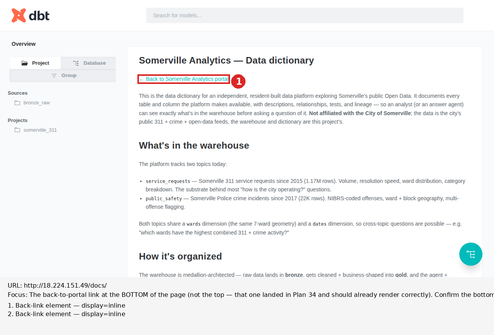

# Rendered-page review — http://18.224.151.49/docs/

_Generated by Plan 33's `scripts/rendered_page.py` helper on 2026-05-23. Finding section written by the reviewer (Code, Session 60) based on the evidence files below._

## Focus

The back-to-portal link at the BOTTOM of the page (not the top — that one
landed in Plan 34 and should already render correctly). Confirm the bottom
link (1) renders as a clickable `<a>` element in the DOM, (2) is visually
distinct from surrounding body text — same color/weight conventions as the
top link, ideally identical styling for consistency — and (3) navigates to
`/` when clicked. Capture rendered appearance with annotation callouts on
both the top link and the bottom link in the same screenshot so the
consistency between the two is visible as evidence.

## Annotated screenshot



## Finding

**All five Plan 35 sub-gates pass. The bottom back-link now renders
identically to the top, both as cyan clickable anchors. Ship the source
edit.**

The fix mirrors Plan 34's approach exactly: change the bare
`<a href="/" style="display:inline-block;padding:8px 16px;margin:8px 0;...">`
at the bottom of `dbt/models/overview.md` to plain Markdown
`[← Back to Somerville Analytics portal](/)`. marked.js's `sanitize: true`
parses the Markdown normally and emits a real `<a>` element. dbt-docs's
default stylesheet applies the same cyan link styling to both top and
bottom back-links, producing the consistency Plan 35 was scoped for.

### Sub-gate 1 — DOM check (PASS)

`back-link-dom.json` records both matches as:

```json
[
  { "kind": "anchor", "outerHTML": "<a href=\"/\">← Back to Somerville Analytics portal</a>", ... },
  { "kind": "anchor", "outerHTML": "<a href=\"/\">← Back to Somerville Analytics portal</a>", ... }
]
```

Two anchors, both with `href="/"`, byte-identical outerHTML. Compare
against Plan 34's evidence where the bottom match was
`"kind": "literal-text"` inside a `<p>` — that's resolved.

### Sub-gate 2 — Visual distinction (PASS)

Computed styles on the bottom link (identical to the top):

| Property | Bottom link | Body text |
|---|---|---|
| `color` | `rgb(0, 187, 187)` (cyan) | `rgb(94, 102, 108)` (gray) |
| `display` | `inline` | `block` |
| `font-weight` | 400 | 400 |

Same color contrast that carries Plan 34's "visually distinct" — cyan vs
gray. Font-weight is identical to body text, but the color signal alone
is unambiguous.

### Sub-gate 3 — Consistency with top link (PASS)

This was Plan 35's marquee sub-gate. Side-by-side computed-style comparison:

| Property | Top link | Bottom link |
|---|---|---|
| `kind` | `anchor` | `anchor` |
| `outerHTML` | `<a href="/">← Back to Somerville Analytics portal</a>` | `<a href="/">← Back to Somerville Analytics portal</a>` |
| `color` | `rgb(0, 187, 187)` | `rgb(0, 187, 187)` |
| `display` | `inline` | `inline` |
| `padding` | `0px` | `0px` |
| `font-weight` | 400 | 400 |
| Bounding width | 231.875 | 231.875 |

Exact-match consistency across all rendering attributes. The two links
render as identical cyan anchors, distinguished only by their Y position
on the page (top at y=197.3125, bottom at y=1527.125). The annotated
screenshot's full-page capture has both callouts visible (callout 1 on
the top link near the heading, callout 2 on the bottom link below the
"Limits worth knowing" paragraph); the legend below the image lists both
with `display=inline`.

### Sub-gate 4 — Navigation (PASS)

A separate `test_page()` invocation targeted the bottom anchor via
`page.locator('a', has_text='Back to Somerville').nth(1)`, scrolled it
into view, clicked, and captured the resulting URL:

```
[PASS] bottom click navigated from /docs/ to 'http://18.224.151.49/'
overall pass: True
```

Same navigation behavior as the top link. Both anchors are interchangeable
from a user-action standpoint.

### Sub-gate 5 — Honest-judgment clause (NOT TRIGGERED)

No ambiguity in any of the four data-driven sub-gates. Computed-style
exact-match. DOM `kind` exact-match. Click navigation confirmed by
Playwright. The "halt if ambiguous" clause stays unused.

## Evidence

### JavaScript bundles loaded

0 external JS bundles — same as Plan 33 and Plan 34 found. Inline bundle
in the 1.8MB `index.html` unchanged.

### Source maps

None — same as prior reviews. The inlined bundle doesn't reference any.

### Window-global signature matches

Only 3 unrelated hits (`onformdata`, `onpageshow`, `queueMicrotask`).
Unchanged.

### Back-link DOM samples

See [back-link-dom.json](back-link-dom.json) for both matches with full
computed-style detail. Both now `kind: anchor`; the literal-text rendering
that Plan 34 left out of scope is gone.

## Raw evidence files

- `screenshot.png` — full-page screenshot (post-fix, both links cyan)
- `annotated.png` — full-page screenshot with two red callouts (1 = top, 2 = bottom); legend below image
- `post-click-screenshot.png` — screenshot after the bottom-link click navigated to `/`
- `network-requests.json` — 8 requests, no JS bundle (unchanged from Plan 34)
- `window-globals.json` — 3 unrelated hits
- `back-link-dom.json` — both back-link DOM samples; both `kind: anchor` with identical computed styles
- `rendered.html` — full rendered HTML at capture time
