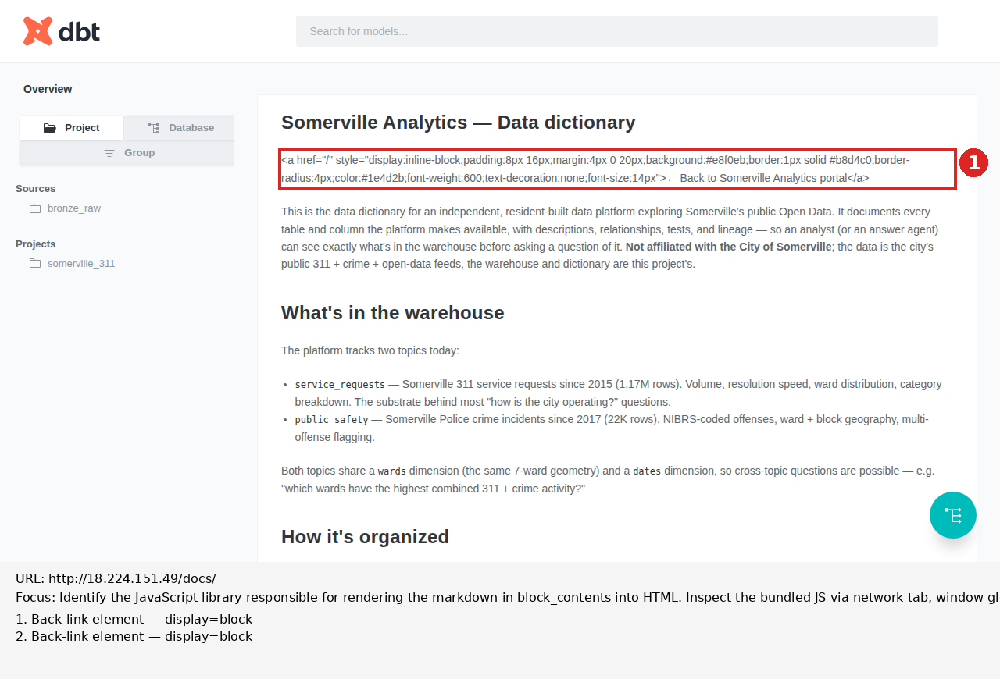

# Rendered-page review — http://18.224.151.49/docs/

_Generated by `scripts/rendered_page.py --demo-inspect-dbt-docs-library` on 2026-05-23. Finding section written by the reviewer (Code, Session 58) based on the evidence files below._

## Focus

Identify the JavaScript library responsible for rendering the markdown in
`block_contents` into HTML. Inspect the bundled JS via network tab, window
globals, and any source-map references. Annotate the rendered back-link
element with its actual DOM shape. The finding feeds Plan 34's back-link fix
and needs to name the library precisely (marked / markdown-it / showdown /
remark / dbt-bespoke / etc.) with evidence.

## Annotated screenshot



## Finding

**The dbt-docs SPA uses [marked.js](https://github.com/markedjs/marked),
invoked with `marked.setOptions({gfm: true, sanitize: true})`. The
`sanitize: true` option is the cause of Plan 32's broken back-link.**

`sanitize: true` is a legacy marked option (present pre-v0.7; removed in
v0.7.0) that escapes all raw HTML in the Markdown source — `<a>`, `<div>`,
`<p>`, and every other tag — and wraps the resulting escaped text in `<p>`
tags. It does not honor block-HTML detection rules; the choice is binary
(escape everything vs. pass everything through). This explains the rendered
state observed in Plan 32: both back-links — the bare `<a>` and the
`<div>`-wrapped variant — came through as literal source text inside a
`<p>`, with computed style `display: block; background: transparent;
color: rgb(94, 102, 108); padding: 0px; font-weight: 400` (plain paragraph
text, no styling reaching the user).

**Implication for Plan 34.** No HTML-shape change to `dbt/models/overview.md`
can produce the intended styled pill button. The `<a>` tag is escaped before
it reaches the DOM, so neither `<p>` wrapping, HTML-comment delimiters, nor
any other Markdown-side trick will work. The realistic fix paths for
Plan 34 are:

1. Drop the styled-pill design — use plain Markdown link form (`[← Back to
   Somerville Analytics portal](/)`) and accept the default dbt-docs link
   style.
2. Inject custom CSS at the `/docs/` URL via an nginx `sub_filter` or
   sibling file (dbt-docs has no built-in custom-CSS hook), targeting the
   first anchor inside `.model-markdown` to give it pill styling.
3. Modify the bundled HTML post-`dbt docs generate` — sed-replace the
   escaped back-link text with the rendered HTML form before serving.
4. Accept that the `/docs/` landing page can't carry the same visual
   back-link as the rest of the portal; instead, surface "back" through
   nginx-level navigation (sidebar, header bar) outside the dbt-docs SPA.

Each has tradeoffs Plan 34 will scope.

## Evidence

### Library identification (`marked.js`, three independent signals)

1. **Project URL embedded in marked's own error-reporting code:**
   `"please report this to https://github.com/markedjs/marked"` (found verbatim in `rendered.html`).

2. **API-shape error messages:**
   `"marked(): input parameter is undefined or null"` and
   `"marked(): input parameter is of type "` — both are exact marked.js error strings.

3. **Frequency:** the bare token `marked` appears 39 times in the rendered
   HTML; no other Markdown-library signature (`markdown-it`, `markdownit`,
   `showdown`, `commonmark`, `remark`, `micromark`) appears at all.

### Configuration — `sanitize: true`

Two grep hits in the bundle prove this is wired on:

- `setOptions({gfm:!0,sanitize:!0})` — minified form of
  `marked.setOptions({gfm: true, sanitize: true})`.
- `sanitize?"paragraph":"html"` — marked's own internal branch deciding
  whether HTML blocks become escaped paragraphs or pass through; with
  `sanitize: true` the `"paragraph"` branch wins, which exactly matches
  the observed `<p>...escaped text...</p>` DOM.

### AngularJS framework signal

Two 404 requests recorded in `network-requests.json`:

- `GET /docs/%7B%7B%20getIcon(item.type,%20'on')%20%7D%7D` (`{{ getIcon(item.type, 'on') }}`)
- `GET /docs/%7B%7B%20getIcon(item.type,%20'off')%20%7D%7D` (`{{ getIcon(item.type, 'off') }}`)

These are AngularJS template-string interpolations that weren't substituted
before being requested as URLs — an unambiguous AngularJS (1.x) signature.
marked.js is wrapped here in a custom AngularJS directive named `marked`,
visible in the inline templates: `<div ... class="model-markdown"
marked="metric.description"></div>` and `<div ... marked="model.description"></div>`.

### Why no JavaScript bundle in the network log

The network log shows only 8 requests: the document itself, `manifest.json`,
`catalog.json`, third-party Snowplow analytics, the two AngularJS-template
404s, and the analytics pixel. **No external `.js` bundle was loaded.**
The reason: the dbt-docs SPA inlines its JavaScript into the
`index.html` (the document is 1.8MB, all-in). All library code — marked,
AngularJS, and dbt-docs's own UI logic — is bundled inline.

### Why no source maps and no window globals

- **Source maps:** the helper probed for `.map` requests; none were
  observed. The inline bundle doesn't reference source maps because there
  are no separate `.js` files to map.
- **Window globals:** the helper scanned `window` for keys matching
  `/mark|md|remark|show|micro|commonmark|markdownit|parse/i`. Only 3 hits
  — `onformdata`, `onpageshow`, `queueMicrotask` — none related to
  Markdown. This is consistent with the bundle being wrapped in an
  IIFE / module scope, so `marked` is enclosed and not attached to
  `window`. Identification had to come from string-grepping the bundle
  text instead.

### Back-link DOM samples (the broken state)

Both back-link instances render identically as literal text inside `<p>`
tags. Computed style on both:

```
display: block
background: transparent
color: rgb(94, 102, 108)   ← default paragraph gray
padding: 0px
font-weight: 400           ← regular weight, not 600
```

Outer HTML of the top instance (escaped — note `&lt;a` not `<a>`):

```html
<p>&lt;a href="/" style="display:inline-block;padding:8px 16px;margin:4px 0 20px;background:#e8f0eb;border:1px solid #b8d4c0;border-radius:4px;color:#1e4d2b;font-weight:600;text-decoration:none;font-size:14px"&gt;← Back to Somerville Analytics portal&lt;/a&gt;</p>
```

The `<a>` markup is escaped to text. The intended `padding`, `border`,
`background`, and `font-weight: 600` from the inline style attribute never
reach the rendered surface because the element itself doesn't exist in the
DOM as an `<a>` — it's just text inside a `<p>`.

## Raw evidence files

- `screenshot.png` — full-page screenshot
- `annotated.png` — screenshot with numbered callouts on both back-link
  instances + legend panel
- `network-requests.json` — full network request/response log (8 requests,
  no JS bundle, two AngularJS-template 404s)
- `window-globals.json` — captured `window` global signature hits
  (3 unrelated hits, no Markdown library)
- `back-link-dom.json` — DOM + computed style for both back-link
  instances, both `kind: literal-text` (broken state)
- `rendered.html` — full rendered HTML at capture time (1.8MB; contains
  inline marked.js + AngularJS + dbt-docs UI)
