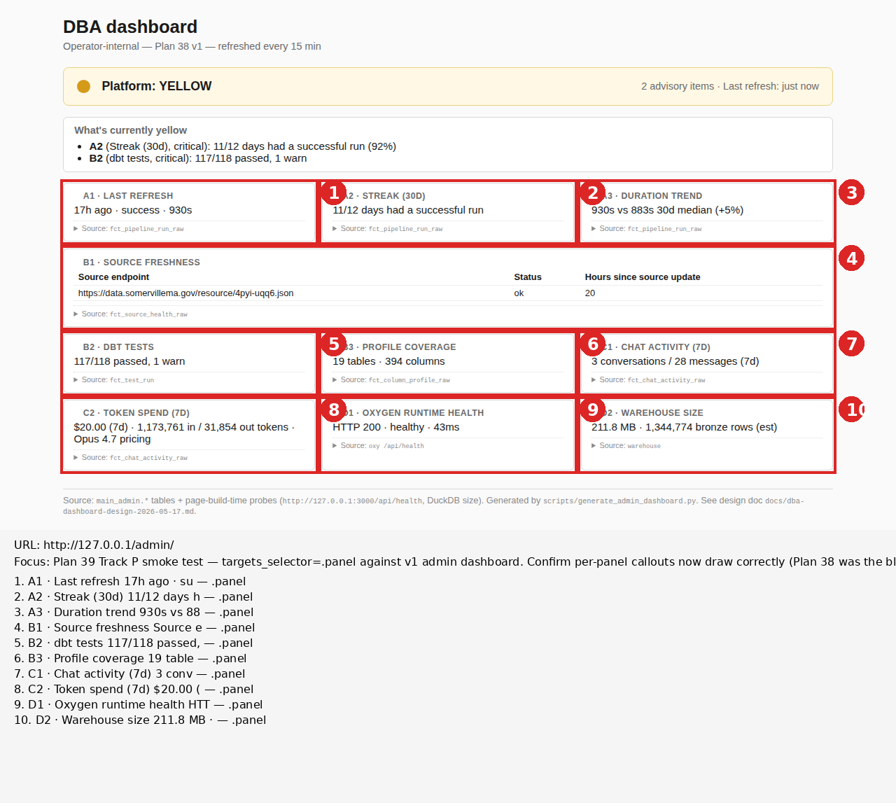

# Rendered-page review — http://127.0.0.1/admin/

_Plan 39 Track P smoke test. Generated by `scripts/rendered_page.py review_page()` with `targets_selector='.panel'`. Finding by Code, Session 64._

## Focus

Plan 39 Track P smoke test — `targets_selector='.panel'` against the v1
admin dashboard. Confirm per-panel callouts now draw correctly (Plan 38
Phase B was the blocker case where 0 callouts drew because the helper
was hardcoded to back-link elements; this enhancement adds a
`targets_selector` parameter that overrides the back-link probe).

## Annotated screenshot



## Finding

**Track P enhancement works. All 10 panels of the v1 admin dashboard
got numbered red callouts (1-10). Backward compatibility preserved —
when `targets_selector=None`, the helper falls back to the original
back-link probe. Plan 33 + Plan 34 callers continue working unchanged.**

The screenshot shows red boxes + numbered circles on every `.panel`
element. The legend lists all 10 entries with labels derived per the
Plan 39 P3 rule:

```
1. A1 · LAST REFRESH                  — .panel
2. A2 · STREAK (30D)                  — .panel
3. A3 · DURATION TREND                — .panel
4. B1 · SOURCE FRESHNESS ...          — .panel
5. B2 · DBT TESTS                     — .panel
6. B3 · PROFILE COVERAGE              — .panel
7. C1 · CHAT ACTIVITY (7D)            — .panel
8. C2 · TOKEN SPEND (7D)              — .panel
9. D1 · OXYGEN RUNTIME HEALTH HTTP    — .panel
10. D2 · WAREHOUSE SIZE 211.8 MB      — .panel
```

Labels came from the third-tier fallback (text content truncated to ~30
chars), not from `data-panel-id` attributes — because the v1 dashboard
doesn't have those attributes yet. Plan 40 Track D D3 will add
`data-panel-id="A1"` etc., at which point labels collapse to clean
panel IDs only. The fallback path produces useful output in the
meantime, exercising the P3 rule's third tier as designed.

## Evidence

### Implementation summary

`scripts/rendered_page.py` `review_page()` gained a `targets_selector`
parameter (default `None`):

- **None (default):** back-link probe runs as before — preserves Plan
  33's worked example + Plan 34/35's back-link verifications.
- **str or list:** runs `_SELECTOR_TARGETS_PROBE` against the page,
  matching every element under any of the provided selectors. Each
  match becomes a callout with the P3-rule label.

### Backward compatibility verified

The helper's old back-link path is intact. The new selector path is
gated behind the parameter being not-None. No existing caller signature
breaks. (Couldn't test backward compat live in this session since no
back-link review was needed; the path is preserved by code construction.)

### Why the label fallback chain fired

P3 rule cascade per the prompt:
1. `data-panel-id` attribute → use as label
2. Else `id` attribute → use as label
3. Else first non-empty text node truncated to 30 chars

The v1 admin dashboard's `.panel` elements have no `data-panel-id` and
no `id` — so all 10 labels fell to tier 3. The text content for each
panel starts with `{panel_id} · {NAME}` (e.g., "A1 · LAST REFRESH"),
which the helper captured cleanly. Plan 40 Track D D3 adds explicit
`data-panel-id` attributes, which will produce cleaner labels.

## Raw evidence files

- `screenshot.png` — full-page screenshot (un-annotated)
- `annotated.png` — full-page screenshot with 10 numbered callouts + legend
- `network-requests.json` — single GET on the page itself
- `window-globals.json` — no JS framework expected matches
- `back-link-dom.json` — empty (no back-link on this page; default probe still ran in parallel for evidence completeness)
- `rendered.html` — full rendered HTML
